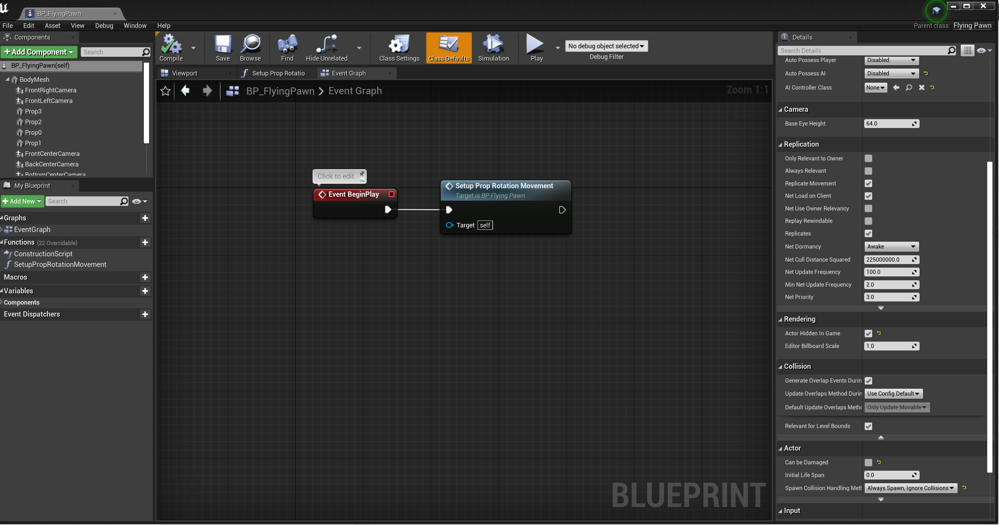
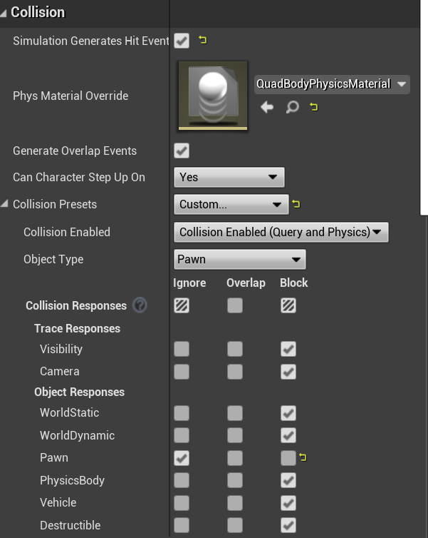
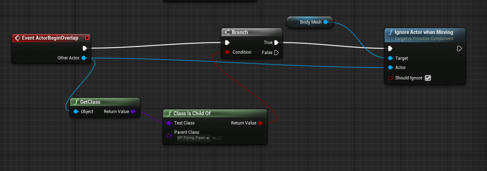

从模型在环（MITL）、软件在环（SITL）、硬件在环（HITL）再到实测（REAL），搞一个对UAV的preception-aware velocity control，下面就让我们开始吧。

# 模型在环（Model-in-the-loop, MITL）仿真训练

## Install
找一台强大的服务器，安装nvidia最新驱动、nvidia docker，并通过如下的NGC container安装全部依赖
```sh
docker login nvcr.io

docker build --pull --network host -t sbdrone_image:v1 -f docker/simulation.dockerfile docker

docker run --name sbdrone --entrypoint /bin/bash \
  -itd --privileged --gpus all -e "ACCEPT_EULA=Y" --network=host \
  -v /tmp/.X11-unix:/tmp/.X11-unix:ro -v $HOME/.Xauthority:/root/.Xauthority -e DISPLAY=$DISPLAY \
  -v /usr/share/vulkan/icd.d/nvidia_icd.json:/etc/vulkan/icd.d/nvidia_icd.json \
  -v /usr/share/vulkan/implicit_layer.d/nvidia_layers.json:/etc/vulkan/implicit_layer.d/nvidia_layers.json \
  -v ~/docker/isaac-sim/cache/ov:/root/.cache/ov:rw \
  -v ~/docker/isaac-sim/cache/pip:/root/.cache/pip:rw \
  -v ~/docker/isaac-sim/cache/glcache:/root/.cache/nvidia/GLCache:rw \
  -v ~/docker/isaac-sim/cache/computecache:/root/.nv/ComputeCache:rw \
  -v ~/docker/isaac-sim/logs:/root/.nvidia-omniverse/logs:rw \
  -v ~/docker/isaac-sim/config:/root/.nvidia-omniverse/config:rw \
  -v ~/docker/isaac-sim/data:/root/.local/share/ov/data:rw \
  -v ~/docker/isaac-sim/documents:/root/Documents:rw \
  -v ~/docker/isaac-sim/cache/kit:/isaac-sim/kit/cache/Kit:rw \
  sbdrone_image:v1

docker exec -it sbdrone /bin/bash
```
以headless app方式启动，并且尝试使用Omniverse Streaming Client
```sh
git clone https://github.com/superboySB/SBDrone && cd SBDrone

ln -s /isaac-sim _isaac_sim  && dos2unix ./orbit.sh && bash ./orbit.sh --vscode

# bash ./orbit.sh -p source/standalone/workflows/rl_games/train.py --task Isaac-Ant-v0 --headless
```

To not restrict running commands only from the top of this repository (where the README.md is located), we recommend adding the executable to your environment variables in your .bashrc or .zshrc file as an alias command. This can be achieved running the following on your terminal:
```sh
# note: execute the command from where the `orbit.sh` executable exists
# option1: for bash users
echo -e "alias orbit=$(pwd)/orbit.sh" >> ${HOME}/.bashrc
# option2: for zshell users
echo -e "alias orbit=$(pwd)/orbit.sh" >> ${HOME}/.zshrc
```


# 软件在环（Software-in-the-loop, SITL）仿真训练

`source /opt/ros/foxy/setup.bash`

# 硬件在环（Hardware-in-the-loop, HITL）调试
考虑到[官方教程](https://www.youtube.com/watch?v=e3HUKGAWdx0)里面的WSL2限制太多，为了便于部署，PX4+RL都建议在远程server（172.16.15.188）的docker里运行，同时airsim在本地windows11开发机（172.16.13.104）里运行。


## Install
```sh
docker build --network host -t sbdrone_image:sitl-v1 .

docker run -itd --privileged -v /tmp/.X11-unix:/tmp/.X11-unix:ro -e DISPLAY=$DISPLAY --gpus all --user=user --env=PX4_SIM_HOST_ADDR=172.23.53.8 --network=host --name=sitl sbdrone_image:sitl-v1 /bin/bash

docker exec -it --user=user sbdrone /bin/bash

git clone https://github.com/superboySB/SBDrone && cd cd SBDrone && pip install -r requirements.txt && pip install -e .
```
为了测试后续ROS2的offboard功能，可以把我构建的docker container作为虚拟机，后续验证流程可以参考这个[教程](https://github.com/Jaeyoung-Lim/px4-offboard/blob/master/doc/ROS2_PX4_Offboard_Tutorial.md)。如果不想用两台机器，想用一台机器做，可以考虑将Dockerfile中的github-token补全，并且取消对UE、Airsim编译的注释，运行`docker build -t mypx4_image:full .`，预计会生成一个300GB左右的image，请留好空间。


## 消除碰撞体（以下是Non-interactive Unreal Engine Custom Environments的英文教程）
We provide the environment presented within the paper to allow others to validate our approach. However, to create a custom environment, we recomend you follow the following steps to prevent agent interaction.

### Remove ego-perspective rendering of other quadrotors
To make the quadrotor invisible in the scene, change the 'Hidden in Scene Capture' to True. This will make it invisible to other drones but the spectator actor can still see it. Go to details, then rendering, this will show the setting 'Actor Hidden In Game'.




### Remove Collision boxes from all agents within the environment
We need to specifically remove agent-agent interaction while also enabling environment interaction. Hence we need to define all components of the quadrotor blueprint 'BP_FlyingPawn' as 'Pawn' and ignore any overlaps that occour between this group. To do this, we modify the collision response within the agent blueprint.

There are five components to change within the 'BP_FlyingPawn' blueprint: BodyMesh, Prop3, Prop2, Prop1, Prop0. For all of these, go to collisions, then change the collision presents to custom. Thange the Object Type to 'Pawn' and then in 'Object Responses' change the Pawn to Ignore as shown bellow.



Now to remove collisions between 'Pawns', we need to ignore the event 'ActorBeginOverlap' which we can do using a Blueprint Event Graph. Add the following event graph to 'BP_FlyingPawn'.



Agents will interact with the environment without interacting with each other.

## 在Airsim里手动控制一台PX4无人机的测试
### 方法一：使用QGC
如果需要手动控制无人机(remote control)，则在QGroundControl里面，必须手动设置通信链接，QGC的自动连接功能在多个机器的时候不起作用，如果在同一台机器有时候没有问题。具体做法是，添加一个14550的UDP监听，并且需要在可选的指定server处添加`172.16.13.104:18570`，并点击连接，如果有多台则需要连接多次，端口要累加。对应地，需要开启多个PX4实例，其它参数配置可以参考[官方教程](https://microsoft.github.io/AirSim/px4_sitl/)，同样端口需要累加。

### 方法二：不使用QGC
在`settings.json`中对需要控制的无人机添加手柄id
```json
"RC": {
		"RemoteControlID": 1
	}
```
打开一个airsim的UE实例，再开启一个PX4实例。
```sh
bash /home/user/PX4-Autopilot/Tools/simulation/sitl_multiple_run.sh 1
```

## 测试强化学习
先打开UE实例，然后依次
```sh
bash /home/user/PX4-Autopilot/Tools/simulation/sitl_multiple_run.sh 5

python sbrl/Storage.py

python sbrl/

```

## TroubleShooting
### 1. 可以换一台网络好的机器直接拉镜像副本，解决docker拉不下来的问题
```sh
docker save > <image-name>.tar sbdrone_image:v1
docker load < <image-name>.tar
```

如果想分享，可以配置一个https://transfer.sh/，分块来存：
```sh
docker save sbdrone_image:v1 | split -b 5G -d - "sbdrone_image.tar.part."
cat sbdrone_image.tar.part.* | docker load
```

### 2. 关于"WSL2本地跑PX4+Windows跑AirSim+Windows跑QGC"的连接问题
如果不用docker，而是在WSL本地跑cmake装PX4来调试，连接问题也会很烦。首先解决PX4与airsim的连接问题，需要在windows的powershell里用`ipconfig`来找本机的WSL IPv4 Address，这需要设置到AirSim中`settings.json`的`LocalHostIp`属性，以及上述教程中所有`PX4_SIM_HOST_ADDR`中。之后每次跑PX4以前，甚至需要人为指定环境变量来找windows本机，例如：
```sh
export PX4_SIM_HOST_ADDR=172.18.240.1
```
其次，需要解决PX4与QGC的连接问题，在QGroundControl里面，需要添加一个14550的UDP监听，并且需要在可选的指定server处添加`<wsl-ip>:18570`,其中`wsl-ip`可以在WSL里面输入`ifconfig`查到外部ip地址（针对windows网络的eth0）,每次重启WSL2这个ip都会刷新，形如：`172.18.243.55:18570`，最后的端口也不一定是`18570`，也要注意PX4版本（详见：`PX4-Autopilot/ROMFS/px4fmu_common/init.d-posix/px4-rc.mavlink`中的`udp_gcs_port_local`）。

### 3. px4编译过程中的自动依赖安装问题
在运行`make px4_sitl_default none_iris`的时候如果遇到警报，可以hit 'u'，避免resolve manually，亲测会省心一点。如果半天卡在`Building for code coverage`，请检查网速是不是太慢。

## 4. 我想修改编译后的UE游戏的窗口等设置
https://blog.csdn.net/qq_33727884/article/details/89487292


# 实际（REAL）部署测试